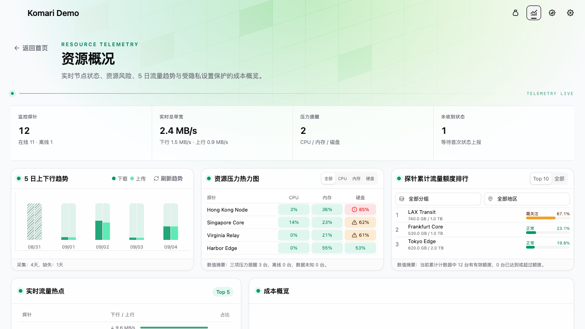

<h1 align="center">Komari Emerald Globe Pro</h1>

<p align="center">面向 Komari Monitor 的现代化监控主题，在 Emerald Globe 的实时节点视图之上提供资源分析、历史流量、成本与续费管理。</p>

<p align="center">
  <a href="https://github.com/allen0039/komari-theme-emerald-globe-pro/releases/latest"></a>
  <a href="LICENSE"></a>
</p>



> 预览图来自主题实际界面，站点名称、节点名称、节点数量、流量和状态均已替换为虚构示例；图中不包含 IP、域名、账户信息或真实费用。

## 主要功能

- 交互式地球：基于 Three.js 与 Globe.gl，支持旋转地球、静止地球、点状地图、摘要卡片和隐藏头部。
- 节点监控：卡片与列表视图、分组筛选、搜索、资源用量、累计流量、在线状态及节点详情图表。
- 三网质量：摘要与明细两种模式，同时展示延迟、丢包和网络健康状态。
- 资源概况：运行摘要、5 日上下行趋势、资源压力热力图、累计流量额度排行和实时流量热点。
- 成本与续费：统一币种换算、月均成本、年度预算、近期续费金额和可筛选的续费时间线。
- 可解释的历史数据：区分历史记录关闭、保留期不足、权限、网络、协议和接口能力异常，不使用虚构流量填补缺失数据。
- 响应式体验：适配桌面与移动设备，支持亮色/暗色模式、自定义背景、减少动画和离线节点后置。
- 发布包校验：提供静态检查、测试、生产构建和 Komari 主题 ZIP 结构验证命令。

## 安装

### 从 GitHub 导入

在 Komari 后台进入 `设置 -> 主题管理 -> 导入主题 -> 导入远程主题`，填写仓库地址：

```text
https://github.com/allen0039/komari-theme-emerald-globe-pro
```

Komari 会读取最新 GitHub Release 中的主题包。后续版本可继续通过主题管理页面更新。

### 从 ZIP 导入

1. 打开 [Releases](https://github.com/allen0039/komari-theme-emerald-globe-pro/releases)。
2. 下载最新版 `komari-theme-emerald-globe-pro-build-*.zip`。
3. 在 Komari 后台的主题管理页面上传该 ZIP，安装后刷新前台页面。

不要上传 GitHub 自动生成的 `Source code` 压缩包；Komari 需要 Release 中以 `komari-theme-emerald-globe-pro-build-` 开头的构建产物。

## 常用设置

主题设置由 Komari 后台管理，完整定义见 [`komari-theme.json`](komari-theme.json)。

| 设置           | 默认值      | 说明                                  |
| -------------- | ----------- | ------------------------------------- |
| 数据更新间隔   | `3` 秒      | 实时状态轮询间隔，建议 1-10 秒        |
| RPC 连接模式   | `websocket` | 可切换为 `http`                       |
| 默认视图模式   | `card`      | 节点卡片或列表                        |
| 头部展示模式   | `earth`     | 地球、静止地球、地图、卡片或隐藏      |
| 访客信息卡片   | 开启        | 可关闭访客网络信息查询和展示          |
| 隐藏后台入口   | 关闭        | 未登录时隐藏后台入口                  |
| 减少动画       | 关闭        | 降低过渡和动态效果                    |
| 延迟节点排序   | 空          | 以英文逗号分隔，固定展示 3 条三网数据 |
| 离线节点后置   | 关闭        | 将离线节点排列在节点列表末尾          |
| 资源统计时区   | `browser`   | 支持浏览器时区、`UTC` 或 IANA 时区    |
| 向访客公开成本 | 关闭        | 关闭时仅管理员可见成本和金额          |
| 成本展示币种   | `CNY`       | 支持人民币、美元、欧元等常用币种      |
| 续费统计天数   | `30`        | 可设置 1-365 天                       |
| 自定义背景     | 关闭        | 支持亮/暗色图片或视频、模糊和遮罩     |

备案号、公安备案及公告内容也可在主题设置中配置。

## 数据与兼容性

- 已覆盖 Komari `1.3.2` 与 `1.4.3` 的历史数据结构；其他版本采用能力探测并尽力兼容。
- 5 日趋势按所选时区的自然日统计，优先使用批量 metrics 查询，仅在明确需要时回退到批量 records 查询。
- 趋势展示的是 Komari 采集的探针流量，不等同于云服务商账单、计费周期或结算流量。
- 历史记录开关、保留时间、访问权限和服务端接口能力会影响趋势的可用范围。
- 地球效果需要 WebGL，建议使用较新的 Chrome、Edge、Firefox 或 Safari。

## 隐私与外部请求

本主题不包含统计分析、广告或用户行为追踪代码，也不会保存 Komari 登录凭据。但浏览器仍会根据启用的功能发起以下请求：

| 功能         | 可能访问的服务                                                      | 隐私说明                                                                             |
| ------------ | ------------------------------------------------------------------- | ------------------------------------------------------------------------------------ |
| 访客信息卡片 | `api.ip.sb`、`ipwho.is`、`api.ipapi.is`、`ipapi.co`、`api.vore.top` | 服务会看到访客公网 IP，并返回 IP、运营商和大致地区；关闭“访客信息卡片”可停止这些请求 |
| 汇率换算     | `api.frankfurter.app`，失败时回退到 `open.er-api.com`               | 仅请求公开汇率，不发送节点价格或账单内容                                             |
| 图标         | `api.iconify.design`                                                | 按需加载图标资源                                                                     |
| 点状世界地图 | jsDelivr 或 GitHub Raw 上的 Apache ECharts 世界地图数据             | 仅下载公开地图 JSON                                                                  |
| 自定义背景   | 站点所有者填写的图片或视频地址                                      | 访客浏览器会直接请求该地址                                                           |

浏览器本地存储用于保存主题模式、视图偏好、个人价值排除项、币种选择以及短期趋势/地图缓存。这些数据不会由主题上传到作者服务器。

公开部署前请特别检查：

- 保持“向访客公开成本”关闭，除非确实要公开节点价格和续费金额。
- 不需要访客定位时关闭“访客信息卡片”。即使卡片处于折叠状态，启用后仍会请求定位服务。
- 视需要开启“隐藏后台入口”，并确认 Komari 本身的鉴权配置正确。
- 审查 Komari 公开接口中的节点名称、地区、公开备注、流量额度和到期日；主题无法替站点所有者隐藏已经由 Komari 对访客公开的数据。
- 发布截图前遮挡 IP、域名、UUID、真实节点名称、费用、账户信息和精确访问位置。

## 本地开发

环境要求：Node.js `^20.19.0` 或 `>=22.12.0`，Bun `>=1.2.0`。

```bash
bun install
bun run dev
bun run lint:check
bun run test
bun run build
bun run verify:package
```

`bun run build` 会同时执行类型检查和生产构建，并生成：

```text
komari-theme-emerald-globe-pro-build-<sha>.zip
```

ZIP 根目录包含 `komari-theme.json`、`preview.png` 和 `dist/`，可直接导入 Komari。

## 技术栈

Vue 3、Vite 7、Tailwind CSS 4、Pinia、reka-ui、ECharts、Three.js、Globe.gl。

## 致谢

- [Komari](https://github.com/komari-monitor/komari)
- [Komari Emerald](https://github.com/Tokinx/komari-theme-emerald)：主题的直接上游项目
- [Komari Glassmorphism](https://github.com/sanrokamlan-prog/komari-theme-Glassmorphism)：彩色地球实现与纹理参考
- [Komari Naive](https://github.com/lyimoexiao/komari-theme-naive)：Emerald 的主题基座

## 许可证

本项目采用 [MIT License](LICENSE)。
